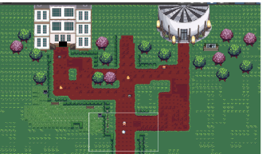
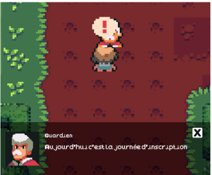
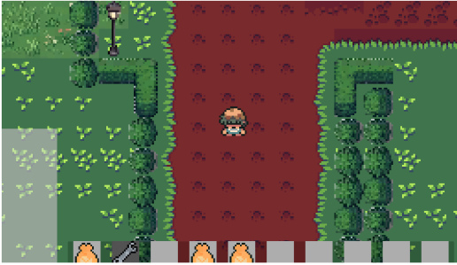
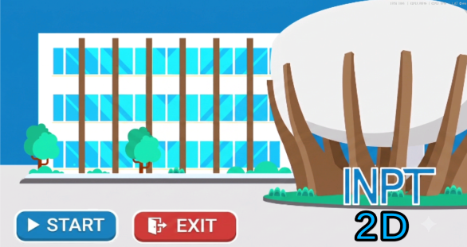

# 🎓 INPT Life Simulator

A top-down 2D RPG set on a pixel-art recreation of the INPT campus.
Walk the esplanade, go inside the class blocks and labs, talk to NPCs,
open chests, and collect items. Built in Unity as a first-year PPP
group project.

## 🛠️ Tech
Unity · C# · Tilemap · Cinemachine · Aseprite

## 🎮 Playing it

**Download:** grab the latest build from
[Releases](https://github.com/Wictox/MPT_Simulation_PPP/releases).

**Controls:** arrow keys or ZQSD to move. Walk up to anything
interactive — an exclamation or dialogue bubble appears above the
player when an action is available.

**From source:** clone and open the folder in Unity [version].

## ⚙️ How it works

**Scenes.** Two of them: `startscene` for the main menu, `SampleScene`
for the game itself.

**Scripts.** Each mechanic gets its own controller rather than living
in one god object — `InventoryController` for the inventory,
`NPCDialogue` for conversations, `BounceEffect` for the animation when
items pop out of a chest, and so on.

**The player** is assembled from components rather than written as a
single class: `Sprite Renderer` for the visual, `Rigidbody 2D` and
`Box Collider 2D` for physical collision with buildings, `Animator`,
plus the custom `PlayerMovement` and `PlayerItemCollector` scripts.

**Level design** uses Unity's Tilemap with a custom Tile Palette, so
grass, dirt paths, and vegetation get painted onto an aligned grid
instead of placed object by object.

**Interaction** covers three entity types — NPCs open an animated
dialogue box, chests physically eject their contents on opening, and
ground items play a confirmation sound and go straight to the inventory.

**Indoor transitions** were the trickiest part. Moving from the outdoor
campus into the Zelafa block runs a coroutine that freezes game time,
fades to black through the UI, updates the `CinemachineConfiner2D`
bounds to the interior, teleports the player to a destination waypoint,
then fades back in. Without the freeze and fade, the camera visibly
snaps as its confiner changes.

## 🗺️ What's next

- **Academic mini-games** — professor NPCs handing out quests based on
  real modules: debugging a C snippet, binary/hex conversion puzzles,
  decrypting a message, subnetting calculations.
- **Branching narrative** — a wider dialogue tree where choices (join a
  club or focus on revisions) affect how the character develops.
- **SQLite persistence** — proper save state for chest IDs and quest
  progress instead of the current approach.
- **NPC pathfinding** — a node graph or NavMesh2D so NPCs move around
  the campus on their own.

## 👥 Team

Built by Walid Fourane, Ismail Chamsy, Salman El Khawlani, and
Hicham Soufi. Supervised by Pr. Abdeslam En-Nouaary.

## 📸 Screenshots

| | |
|---|---|
|  |  |
|  |  |

